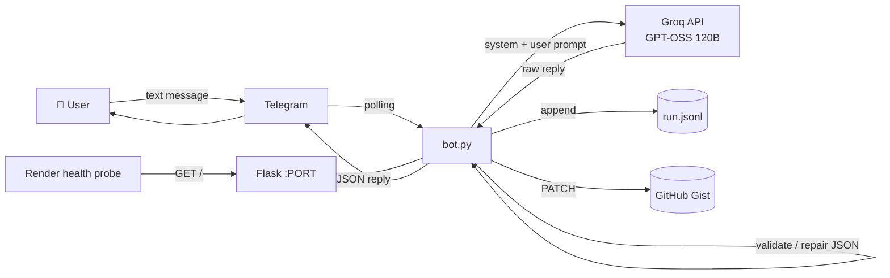

<div align="center">

# 🤖 TDS26 Data-Analyst Telegram Bot

**A Telegram bot that answers data-analysis questions as strict, machine-readable JSON, powered by GPT-OSS on Groq.**

</div>

<div align="center">
    
### TDS Data Analyst Bot

### 👉 [Try the bot on Telegram: @tds26_data_analyst_bot](https://t.me/tds26_data_analyst_bot)

[](https://t.me/tds26_data_analyst_bot)

</div>

---

## ✨ Features

- 💬 **Telegram interface**: send a question as plain text, get an answer back.
- 🧮 **Computes, never guesses**: the model is a tool-calling agent that downloads your data (`fetch_url`) and runs pandas/numpy code (`run_python`) to get exact numbers.
- 📦 **Strict JSON replies**: always exactly one object with `answer` and `log_url`, shaped as you requested.
- 🔧 **Self-repair**: handles code fences, chatter, malformed tool calls and invalid JSON with forced-final and repair passes before a safe error object.
- ⚡ **Non-blocking**: model, network and code execution run in worker threads, so one slow request never freezes other users.
- 🛡️ **Safety**: SSRF-protected downloads (private IPs blocked on every redirect), size limits, a resource-limited code subprocess with a scrubbed environment, optional user allow-list.
- 📝 **Full run logs**: each run, including every tool step, is appended to `run.jsonl` and synced to a public GitHub Gist (capped in size).
- ❤️ **Always awake**: health endpoint plus an optional self-ping to stop Render's free tier from sleeping.
- ✅ **Tested**: unit tests for JSON handling, SSRF blocking, code sandboxing and the agent loop, run in CI.

## 🏗️ How it works



1. A user sends a message; it is also saved to `message.txt` in a temporary work directory.
2. The model agent decides which tools to call: `fetch_url` to download data, `run_python` to analyse it. It loops for up to `MAX_AGENT_STEPS`.
3. The final text is parsed, validated and, if needed, repaired into `{"answer", "log_url"}`.
4. `log_url` is always overwritten with your configured `LOG_PUBLIC_URL`.
5. The run (with all tool steps) is logged locally, pushed to the Gist, and the JSON is sent back. Replies over 4000 characters are sent as `answer.json`.

## 📨 Example

**You send:**

```text
Here is a CSV: state,sales
Texas,120
Ohio,90
Utah,150
Reply with ONLY this JSON object: {"answer": {"state": "<state with highest sales>"}, "log_url": "<url>"}
```

**Bot replies:**

```json
{"answer": {"state": "Utah"}, "log_url": "https://gist.githubusercontent.com/<you>/<gist-id>/raw/run.jsonl"}
```

## 🚀 Quick start

### 1. Clone and install

```bash
git clone https://github.com/23f1001475/TDS26-T2-P1-Q3.git
cd TDS26-T2-P1-Q3
python -m venv .venv
source .venv/bin/activate      # Windows: .venv\Scripts\activate
pip install -r requirements.txt
```

### 2. Configure environment variables

```bash
cp .env.example .env
# then fill in your keys
```

| Variable | Required | Default | Description |
|---|:---:|---|---|
| `TELEGRAM_BOT_TOKEN` | ✅ | n/a | Token from [@BotFather](https://t.me/BotFather) |
| `GROQ_API_KEY` | ✅ | n/a | Key from [console.groq.com](https://console.groq.com) |
| `GROQ_BASE_URL` | ❌ | `https://api.groq.com/openai/v1` | OpenAI-compatible endpoint |
| `GROQ_MODEL` | ❌ | `openai/gpt-oss-120b` | Model used for answers |
| `GROQ_FALLBACK_MODEL` | ❌ | `openai/gpt-oss-20b` | Used automatically when the main model is rate limited or retired |
| `LOG_PUBLIC_URL` | ✅ | `none` | Public raw URL of your Gist log, without the commit hash: `https://gist.githubusercontent.com/<user>/<id>/raw/run.jsonl` |
| `LOCAL_LOG_PATH` | ❌ | `run.jsonl` | Local JSONL log file |
| `GITHUB_TOKEN` | ❌ | n/a | Token with `gist` scope, for log upload |
| `GIST_ID` | ❌ | n/a | ID of the Gist to update |
| `GIST_FILENAME` | ❌ | `run.jsonl` | File name inside the Gist |
| `PORT` | ❌ | `10000` | Port for the health-check server |
| `ALLOWED_USER_IDS` | ❌ | empty (everyone) | Comma-separated Telegram user IDs allowed to use the bot |
| `MAX_AGENT_STEPS` | ❌ | `6` | Max tool-calling rounds per message |
| `MAX_CONCURRENT` | ❌ | `3` | Messages processed in parallel |
| `PY_TIMEOUT` / `PY_MEMORY_MB` | ❌ | `25` / `1536` | Time and memory limits for analysis code |
| `MAX_FETCH_BYTES` | ❌ | `15728640` | Max download size (15 MB) |
| `MAX_GIST_BYTES` | ❌ | `800000` | Max log size uploaded to the Gist (newest runs kept) |
| `KEEPALIVE` | ❌ | `1` | Set `0` to disable the Render self-ping |
| `DROP_PENDING_UPDATES` | ❌ | `0` | Set `1` to ignore messages sent while the bot was offline |

### 3. Run

```bash
export $(grep -v '^#' .env | xargs)   # load .env (Linux/macOS)
python bot.py
```

Open Telegram, find your bot, and send it a message. 🎉

Run the tests with:

```bash
pip install -r requirements-dev.txt
pytest -q tests
```

## ☁️ Deploy on Render

This repo includes a `Procfile` and a `render.yaml` blueprint.

1. Push the repo to GitHub.
2. In Render, choose **New → Blueprint** and select this repo (or create a **Web Service** manually).
3. Add the environment variables from the table above.
4. Deploy. Render will hit `GET /` to confirm the bot is alive.

> 💡 If you deploy as a **Background Worker**, the Flask keep-alive server is optional.

## 📁 Project structure

```text
.
├── bot.py              # Bot logic, LLM calls, logging, Flask health check
├── requirements.txt    # Runtime dependencies
├── requirements-dev.txt# Test / lint dependencies
├── tests/              # Unit tests (pytest)
├── Procfile            # Process definition for Render / Heroku-style hosts
├── render.yaml         # Render blueprint
├── .env.example        # Template for environment variables
├── .github/workflows/  # CI (lint + tests)
└── LICENSE
```

## 🔒 Security notes

- Never commit `.env` or real tokens. `.env` is git-ignored.
- Give `GITHUB_TOKEN` **only** the `gist` scope.
- Analysis code runs in a resource-limited subprocess with no secrets in its environment and a static filter blocking network, `os.environ`, `subprocess`, etc. This is defence in depth, **not** a perfect sandbox. If your bot is not meant to be public, set `ALLOWED_USER_IDS`.
- The log Gist may be public and contains user messages and usernames. Do not send sensitive data to the bot.
- Render's free disk is ephemeral: `run.jsonl` resets on redeploy. Older runs survive only until the next upload overwrites the Gist.

## 🛣️ Roadmap

- [ ] Support Telegram file uploads (CSV / Excel) directly in chat
- [ ] Charts returned as images
- [ ] Container-level sandboxing for code execution
- [ ] Persistent log storage that survives redeploys

## 🤝 Contributing

Issues and pull requests are welcome. For larger changes, please open an issue first to discuss what you would like to change.

## 📄 License

Released under the [MIT License](LICENSE).

---

## Author

**Vivek Mittal**

* [LinkedIn](https://www.linkedin.com/in/vivek-mittal-574a31250/)
* [GitHub](https://github.com/23f1001475)

---

<div align="center">
Built by <a href="https://github.com/23f1001475">@23f1001475</a> for the TDS course project.
</div>
